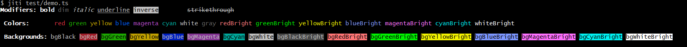

# use-colors

> ANSI terminal styling library

[](https://www.npmjs.com/package/use-colors)
[](https://www.npmjs.com/package/use-colors)
[](https://codecov.io/gh/teneplaysofficial/use-colors)

A lightweight ANSI styling library for Node.js that supports chained styles, template literals, RGB colors, and automatic terminal color detection.



## Installation

```bash
npm install use-colors
```

## Usage

```ts
import colors from 'use-colors';

// basic colors
console.log(colors.red('Error message'));
console.log(colors.green('Success message'));
console.log(colors.yellow('Warning message'));
console.log(colors.blue('Information message'));

// style modifiers
console.log(colors.bold('Bold text'));
console.log(colors.underline('Underlined text'));
console.log(colors.italic('Italic text'));

// chained styles
console.log(colors.bold.red('Bold red text'));
console.log(colors.underline.blue('Underlined blue text'));
console.log(colors.inverse.yellow('Inverse yellow text'));

// bright colors
console.log(colors.redBright('Bright red'));
console.log(colors.greenBright('Bright green'));
console.log(colors.blueBright('Bright blue'));

// background colors
console.log(colors.bgRed.white('White text on red background'));
console.log(colors.bgGreen.black('Black text on green background'));
console.log(colors.bgBlue.white('White text on blue background'));

// nested styles
const user = colors.green('Alex');
console.log(colors.blue(`User ${user} logged in`));

// template literal
const name = 'Alex';
const score = 42;

console.log(colors.green`User ${name} logged in`);
console.log(colors.yellow`Score: ${score}`);
console.log(colors.red.bold`Error: ${'Connection failed'}`);

// custom colors

// RGB
console.log(colors.rgb(255, 0, 0)('Custom red'));
console.log(colors.rgb(0, 255, 0)('Custom green'));
console.log(colors.rgb(0, 128, 255)('Custom blue'));

// HEX
console.log(colors.hex('#ff5733')('HEX color example'));
console.log(colors.hex('#00ffcc')('Bright teal text'));
console.log(colors.hex('#f00')('Short hex red'));

// ANSI256
console.log(colors.ansi256(196)('Bright red'));
console.log(colors.ansi256(33)('Blue tone'));
console.log(colors.ansi256(82)('Green tone'));

// ANSI Utilities

// Strip ANSI codes
// Remove ANSI styling from text.
const text = colors.red('Hello');

console.log(colors.strip(text));
// Hello

// Detect ANSI codes
// Check if a string contains ANSI escape sequences.
const styled = colors.green('Hello');

console.log(colors.hasAnsi(styled));
// true
```

## Configuration

You can control the color level manually.

```ts
import colors from 'use-colors';

colors.config({ level: 0 }); // disable colors

console.log(colors.red('No colors'));
```

Available levels:

| Level | Description        |
| ----- | ------------------ |
| `0`   | No colors          |
| `1`   | ANSI16 colors      |
| `2`   | ANSI256 colors     |
| `3`   | Truecolor (24-bit) |

## Custom Instances

Create an isolated color instance.

```ts
import { createColors } from 'use-colors';

const c = createColors({ level: 3 });

console.log(c.blue('Custom instance'));
```

This is useful when building tools or libraries that need their own color configuration.

## Supported ANSI Styles

### Modifiers

- bold
- dim
- italic
- underline
- inverse
- hidden
- strikethrough

### Colors

- black
- red
- green
- yellow
- blue
- magenta
- cyan
- white
- gray
- redBright
- greenBright
- yellowBright
- blueBright
- magentaBright
- cyanBright
- whiteBright

### Background Colors

- bgBlack
- bgRed
- bgGreen
- bgYellow
- bgBlue
- bgMagenta
- bgCyan
- bgWhite
- bgBlackBright
- bgRedBright
- bgGreenBright
- bgYellowBright
- bgBlueBright
- bgMagentaBright
- bgCyanBright
- bgWhiteBright

## Automatic Color Detection

`use-colors` automatically detects the terminal's color capability and adjusts the output accordingly.

The library checks common environment variables and terminal settings to determine the supported color level.

### Detection Order

Color support is determined using the following signals:

- `NO_COLOR` → disables colors
- `FORCE_COLOR` → forces colors
- `COLORTERM=truecolor` or `COLORTERM=24bit` → enables truecolor
- `TERM=*-256color` → enables ANSI256 colors
- otherwise → falls back to basic ANSI16 colors

### Color Levels

| Level | Description        |
| ----- | ------------------ |
| `0`   | No colors          |
| `1`   | ANSI16 colors      |
| `2`   | ANSI256 colors     |
| `3`   | Truecolor (24-bit) |

## Environment Examples

Disable colors:

```bash
NO_COLOR=1 node app.js
```

Force colors:

```bash
FORCE_COLOR=1 node app.js
```

Force truecolor terminals:

```bash
COLORTERM=truecolor node app.js
```
